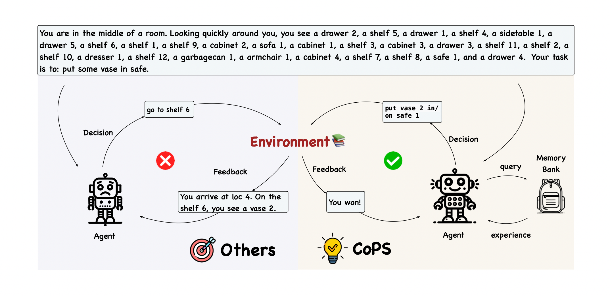

# CoPS: Empowering LLM Agents with Provable Cross-Task Experience Sharing

This repo holds the code for [CoPS: Empowering LLM Agents with Provable Cross-Task Experience Sharing]() by Chen Yang, Chenyang Zhao, Quanquan Gu and Dongruo Zhou.  



CoPS enhances sequential reasoning in LLM-powered agents by enabling effective sharing and selection of cross-task experiences through a pessimism-based strategy.

## Installation

Our repo is mainly build on SGLang version 0.2.15.

```shell
git clone -b v0.2.15 https://github.com/sgl-project/sglang.git
cd sglang
pip install -e "python[all]"

# Modify the version of flashinfer to your own device
pip install flashinfer -i https://flashinfer.ai/whl/cu121/torch2.4/
```

For the installation of Alfworld and Webshop benchmarks locally, please refer to the following links:

[https://github.com/alfworld/alfworld](https://github.com/alfworld/alfworld)

[https://github.com/princeton-nlp/WebShop](https://github.com/princeton-nlp/WebShop)

## Reproduce

To reproduce results on each benchmarks, refer to their subdirectory.

## Model Sever

To accerlerate the running efficiency of COPS, we implement a data-paralysis serving router and engine with SGLang backend, i.e., the [ModelServer](https://github.com/zhaochenyang20/ModelServer). After configuration, you can get a response or embedding from these kind of commands:

```
from model_sever import ModelServer
message = [
    {
        "role": "user",
        "content": "Interact with a household to solve a task. Here are a few examples.\nYou are in the middle of a room. Looking quickly around you, you see a cabinet 4, a cabinet 3, a cabinet 2, a cabinet 1, a coffeemachine 1, a countertop 1, a diningtable 3, a diningtable 2, a diningtable 1, a drawer 1, a fridge 1, a garbagecan 1, a microwave 1, a sidetable 1, a sinkbasin 1, a stoveburner 4, a stoveburner 3, a stoveburner 2, a stoveburner 1, and a toaster 1.\nYour task is to: find some apple and put it in sidetable.\n> think: To solve the task, I need to find and take an apple, then put it in sidetable.\nOK.\n> think: First I need to find an apple. An apple is more likely to appear in fridges (1), diningtables (1-3), sidetables (1), countertops (1), sinkbasins (1), garbagecan (1). I can check one by one, starting with fridge 1.\nOK.\n> go to fridge 1\nThe fridge 1 is closed.\n> open fridge 1\nYou open the fridge 1. The fridge 1 is open. In it, you see a lettuce 2, a mug 2, a potato 2, and a tomato 1.\n> go to diningtable 1\nOn the diningtable 1, you see nothing.\n> go to diningtable 2\nOn the diningtable 2, you see a pineapple 1.\n> go to diningtable 3\nOn the diningtable 3, you see a bowl 2, a bowl 1, a bread 2, and a bread 1.\n> go to sidetable 1\nOn the sidetable 1, you see a cup 1, a lettuce 1, a peppershaker 3, a potato 1, and a saltshaker 1.\n> go to countertop 1\nOn the countertop 1, you see a butterknife 1, a dishsponge 1, and a soapbottle 1.\n> go to sinkbasin 1\nOn the sinkbasin 1, you see a cup 2, a egg 1, a mug 1, and a potato 3.\n> go to garbagecan 1\nOn the garbagecan 1, you see a apple 3, and a egg 3.\n> think: Now I find an apple (3). Next, I need to take it.\n> take apple 3 from garbagecan 1\nYou pick up the apple 3 from the garbagecan 1.\n> think: Now I find an apple (3). Next, I need to put it in/on sidetable 1.\nOK.\n> go to sidetable 1\nOn the sidetable 1, you see a cup 1, a lettuce 1, a peppershaker 3, a potato 1, and a saltshaker 1.\n> put apple 3 in/on sidetable 1\nYou put the apple 3 in/on the sidetable 1.\nYou are in the middle of a room. Looking quickly around you, you see a cabinet 4, a cabinet 3, a cabinet 2, a cabinet 1, a countertop 1, a garbagecan 1, a handtowelholder 2, a handtowelholder 1, a sinkbasin 2, a sinkbasin 1, a toilet 1, a toiletpaperhanger 1, and a towelholder 1.\nYour task is to: put some spraybottle on toilet.\n> think: To solve the task, I need to find and take a sparybottle, then put it on toilet.\nOK.\n> think: First I need to find a spraybottle. A spraybottle is more likely to appear in cabinet (1-4), countertop (1), toilet (1), sinkbasin (1-2), garbagecan (1). I can check one by one, starting with cabinet 1.\nOK.\n> go to cabinet 1\nOn the cabinet 1, you see a cloth 1, a soapbar 1, a soapbottle 1.\n> go to cabinet 2\nThe cabinet 2 is closed.\n> open cabinet 2\nYou open the cabinet 2. The cabinet 2 is open. In it, you see a candle 1, and a spraybottle 2.\n> think: Now I find a spraybottle (2). Next, I need to take it.\n> take spraybottle 2 from cabinet 2\nYou pick up the spraybottle 2 from the cabinet 2.\n> think: Now I take a spraybottle (2). Next, I need to put it in/on toilet 1.\nOK.\n> go to toilet 1\nOn the toilet 1, you see a soapbottle 2.\n> put spraybottle 2 in/on toilet 1\nYou put the spraybottle 2 in/on the toilet 1.\n\n\nHere is the task:\nYou are in the middle of a room. Looking quickly around you, you see a bed 1, a desk 2, a desk 1, a drawer 6, a drawer 5, a drawer 4, a drawer 3, a drawer 2, a drawer 1, a garbagecan 1, a laundryhamper 1, a safe 1, a shelf 6, a shelf 5, a shelf 4, a shelf 3, a shelf 2, and a shelf 1.\nYour task is to: put a mug in desk.\n>",
    },
    {
        "role": "assistant",
        "content": "think: To solve the task, I need to find and take a mug, then put it in/on desk.",
    },
    {"role": "user", "content": "OK."},
    {
        "role": "assistant",
        "content": "think: First I need to find a mug. A mug is more likely to appear in desk (1-2), drawer (1-6), shelf (1-6), garbagecan (1), laundryhamper (1), safe (1). I can check one by one, starting with desk 1.",
    },
    {"role": "user", "content": "OK."},
    {"role": "assistant", "content": "go to desk 1"},
    {
        "role": "user",
        "content": "On the desk 1, you see a bowl 1, a cd 2, a creditcard 2, a desklamp 1, a keychain 1, a laptop 2, a pen 2, and a pencil 2.",
    },
    {
        "role": "assistant",
        "content": "think: Now I don't find a mug in desk 1. Next, I need to check desk 2.",
    },
    {"role": "user", "content": "OK."},
    {"role": "assistant", "content": "go to desk 2"},
    {
        "role": "user",
        "content": "On the desk 2, you see a alarmclock 1, a book 3, a bowl 2, a creditcard 3, and a keychain 3.",
    },
]

server = ModelServer()
# `8` here is the completion model size configured in the `client_configs`
complition = server.get_completion_or_embedding("8", message)
# get the completion from a 8b instruct model, i.e. Llama3.1 8B
print(complition)

# `7` here is the embedding model size configured in the `client_configs`
embedding = server.get_completion_or_embedding(
    "7",
    message="As a general guideline, the CDC's average requirement of protein for women ages 19 to 70 is 46 grams per day. But, as you can see from this chart, you'll need to increase that if you're expecting or training for a marathon. Check out the chart below to see how much protein you should be eating each day.",
    get_embedding=True,
)
# get the embedding of a 7b embedding model, i.e. `Alibaba-NLP/gte-Qwen1.5-7B-instruct`
print(embedding[:10])
```

## Other Notes

Check out the code for the original code [TODO]()

For all questions, contact [cya2@iu.edu](cya2@iu.edu)

## Cite

```bibtex

```